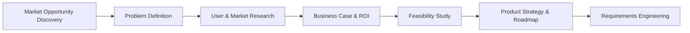

## Pre-Development Phase Overview

The **Pre-Development** macro-phase contains all activities that occur **before engineering begins writing production code**. It ensures that the team is solving the right problem, for the right users, in a way that aligns with business strategy and is feasible to deliver.

Think of this phase as the **“thinking and validating” engine** of product development. By the time engineering starts building, the team should already have:

- A clearly defined **opportunity** in the market.
- A well-understood **problem** worth solving.
- Evidence from **users, market, and data**.
- A **viable business case** and **feasibility assessment**.
- A **strategy and roadmap** that guide execution.
- Clear, testable **requirements** that engineering can implement.

### Phases Inside Pre-Development

Pre-Development is broken into 7 phases. In a real organization, these phases often **overlap and iterate**, but conceptually they can be viewed as a flow:

1. **Market Opportunity Discovery**  
   - Identify and explore **where value might exist** in the market.  
   - Output: prioritized list of opportunity hypotheses.  
   - See detailed guide in `1-market-opportunity-discovery/README.md`.

2. **Problem Definition**  
   - Turn raw opportunities into **clear problem statements**.  
   - Answer: *Who has this problem? What is painful? How do they solve it today?*

3. **User & Market Research**  
   - Collect **qualitative and quantitative evidence** about users, customers, and the market.  
   - Use interviews, surveys, data analysis, competitor analysis, etc.

4. **Business Case & ROI Analysis**  
   - Estimate **commercial impact**, investment required, and expected returns.  
   - Decide whether this is **worth doing now**, later, or never.

5. **Feasibility Study (Technical + Operational)**  
   - Validate that the opportunity can be built and operated **safely and reliably**.  
   - Consider architecture, dependencies, security, compliance, and change management.

6. **Product Strategy & Roadmap**  
   - Translate insights into a **coherent product strategy** and a **sequenced roadmap**.  
   - Define phases, milestones, and major releases.

7. **Requirements Engineering (PRD / User Stories)**  
   - Convert strategy and roadmap into **concrete, testable requirements**.  
   - Produce PRDs, epics, user stories, and acceptance criteria.

### Objectives of Pre-Development

- **Identify opportunities** that align with the organization’s strategy and capabilities.
- **Understand users, market, and competition** deeply (not just at surface level).
- **Clarify the problem** and define a solution space with clear boundaries.
- **Quantify value and cost** to justify investment decisions.
- **Assess feasibility** from technical, operational, security, and regulatory perspectives.
- **Prioritize and plan** features into a realistic roadmap.
- **Translate strategy into actionable requirements** for engineering.

If these steps are skipped or rushed, teams often:

- Build **solutions nobody needs**.
- Discover **feasibility blockers too late**.
- Underestimate **time, cost, and risk**.
- Ship features that **don’t move business metrics**.

### High-Level Process Flow (Pre-Development)

### How to Use This Folder (For Beginners)

If you are **new to product development or software engineering in enterprises/banks**, you can treat this folder as a **step‑by‑step learning path**:

- **Step 1 – Understand the big picture**  
  Read this `README.md` to understand *why* Pre-Development exists and how the 7 phases connect.

- **Step 2 – Deep dive into each phase**  
  Open the subfolders (for example `1-market-opportunity-discovery/`) and read their `README.md` files.  
  These will explain:
  - What the phase is.
  - Why it matters.
  - Typical activities, inputs, and outputs.
  - Roles involved and tools used.
  - Examples and common mistakes.

- **Step 3 – Follow the links and topic files**  
  Inside each phase (for example `1-market-opportunity-discovery`), you’ll find **detailed topic files** like:
  - `01-concepts.md` — core ideas explained simply.
  - `02-objectives.md` — what success looks like.
  - `03-workflow.md` — step‑by‑step process.
  - … and more specialized files (frameworks, tools, metrics, templates, glossary, etc.).

- **Step 4 – Apply to your own context**  
  As you read, you can:
  - Map examples to your own organization.
  - Use checklists and templates to run real activities.
  - Share links with teammates to align understanding.

This structure is designed to be **beginner‑friendly** but still **deep enough for senior practitioners**.