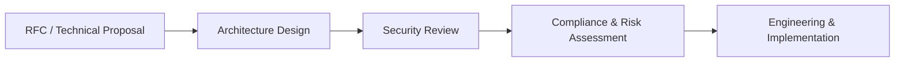

## Architecture & Governance Overview

The **Architecture & Governance** macro‑phase comes **immediately after Pre‑Development**.

By this point you already have:

- validated opportunities and problems,
- research and feasibility,
- a product strategy and roadmap,
- detailed requirements (PRDs, user stories, NFRs).

Architecture & Governance ensures that all of this is turned into **technically sound, secure, compliant, and approved solutions** that fit the wider enterprise ecosystem.

---

### Phases Inside Architecture & Governance

This macro‑phase is broken into 4 phases. In real organizations they often overlap with delivery planning, but conceptually you can view them as a flow:

8. **RFC / Technical Proposal**  
   - Capture **structured technical proposals** for significant changes.  
   - Compare options, trade‑offs, and get cross‑team feedback and approvals.  
   - See detailed guide in `8-rfc/README.md`.

9. **Architecture Design**  
   - Turn the chosen proposal into **concrete system and integration designs**.  
   - Define components, interfaces, data flows, and deployment topology.  
   - Align with enterprise architecture standards and reference architectures.

10. **Security Review**  
    - Assess threats, vulnerabilities, and **security controls** for the proposed solution.  
    - Ensure alignment with security policies and regulatory expectations (e.g., data protection, access control, logging).

11. **Compliance & Risk Assessment**  
    - Confirm that the solution meets **regulatory, legal, and internal risk requirements**.  
    - Capture required controls, evidence, and sign‑offs before major investments in build and rollout.

Together, these phases answer:

- “Is this solution **architecturally sound**?”  
- “Is it **secure and compliant enough** for our risk appetite?”  
- “Has it been **reviewed and approved** by the right people?”  

before significant engineering investment is made.

---

### Objectives of Architecture & Governance

- **Translate requirements into technical proposals** (RFCs) that can be reviewed and improved.
- **Design robust, evolvable architectures** that:
  - fit existing platforms and integrations,
  - respect performance, resilience, and security needs.
- **Identify and mitigate security and compliance risks early**, not just at go‑live.
- **Establish clear governance and approvals** for major changes:
  - architecture boards,
  - security and risk forums,
  - sign‑off processes.
- **Enable consistency and reuse** across teams and platforms:
  - shared patterns,
  - common services and platforms,
  - standard NFR baselines.

If this phase is skipped or rushed, teams often:

- build solutions that **conflict with existing architecture**,
- discover **security or compliance blockers too late**,
- duplicate platforms or capabilities unnecessarily,
- struggle to defend decisions during **audits or incidents**.

---

### High‑Level Process Flow (Architecture & Governance)



This flow connects:

- **Pre‑Development** (requirements and roadmap)  
to:
- **Engineering & Implementation** (detailed design, build, test, deploy),

with Architecture & Governance acting as the **bridge and safety layer**.

---

### How to Use This Folder (For Beginners)

If you are **new to architecture and governance in enterprises/banks**, treat this folder as a **guided path**:

- **Step 1 – Understand the big picture**  
  Read this `README.md` to see how the 4 phases fit together and why they exist.

- **Step 2 – Start with RFCs**  
  Open `8-rfc/README.md` to learn how to write and run RFCs / technical proposals.  
  This is usually the first concrete artifact you will create in this macro‑phase.

- **Step 3 – Follow into design, security, and risk**  
  As you progress, read:
  - `9-architecture-design/README.md` – deep dive into system and integration design.  
  - `10-security-review/README.md` – how security reviews work and what they expect.  
  - `11-compliance-risk/README.md` – how compliance and risk assessment are done.

- **Step 4 – Connect back to Pre‑Development and forward to Engineering**  
  Always keep in mind:
  - inputs from pre‑development (strategy, feasibility, requirements),  
  - outputs needed by engineering (detailed designs, decisions, approvals).

This structure is designed to be **beginner‑friendly** while still giving enough depth for senior engineers, architects, and risk/security practitioners.

## Architecture & Governance Overview

The **Architecture & Governance** macro-phase ensures that proposed solutions are **technically sound, secure, compliant, and aligned with enterprise standards**. In large organizations and banks, this is critical to manage complexity, reuse shared capabilities, and satisfy regulatory obligations.

It covers 4 phases:

8. RFC / Technical Proposal  
9. Architecture Design  
10. Security Review  
11. Compliance & Risk Assessment


### Objectives

- **Translate requirements into technical proposals** (RFCs).
- **Design robust architectures** that fit the enterprise ecosystem.
- **Identify and mitigate security and compliance risks** early.
- **Establish governance and approvals** for major changes.
- **Enable consistency and reuse** across teams and platforms.


### High-Level Process Flow (Architecture & Governance)

```mermaid
flowchart LR
    A[RFC / Technical Proposal] --> B[Architecture Design]
    B --> C[Security Review]
    C --> D[Compliance & Risk Assessment]
    D --> E[Engineering & Implementation]