## Enterprise SDLC Guide

This repository documents a 17-phase **Enterprise Software Development Lifecycle (SDLC)** used in large technology companies, financial institutions, and regulated enterprises. It is designed for **product managers, software engineers, architects, SRE/DevOps, security, and compliance teams**.

The lifecycle goes beyond basic "requirements–design–build–test–deploy" to cover **discovery, governance, security, compliance, operations, and continuous improvement**. It provides terminology, process flows, examples, and checklists that can be adapted to your organization.


### What Is the Enterprise SDLC?

The Enterprise SDLC is a **structured, repeatable process** for building and evolving software products and platforms. It ensures that:

- **Business value** is clearly understood and measured.
- **Risk** (technical, operational, security, regulatory) is managed intentionally.
- **Quality** is built-in via testing, reviews, and automation.
- **Governance** (architecture, security, compliance) is embedded in the process.
- **Feedback loops** from production guide continuous improvement.

At a high level, the model is divided into five macro-phases:

1. **Pre‑Development** (strategy, research, and requirements)
2. **Architecture & Governance** (technical design, security, compliance)
3. **Engineering** (implementation and integration)
4. **Release** (testing and deployment)
5. **Operations** (monitoring and continuous improvement)


### Full 17‑Phase Lifecycle

The 17 phases are:

1. Market Opportunity Discovery  
2. Problem Definition  
3. User & Market Research  
4. Business Case & ROI Analysis  
5. Feasibility Study (Technical + Operational)  
6. Product Strategy & Roadmap  
7. Requirements Engineering (PRD / User Stories)  

8. RFC / Technical Proposal  
9. Architecture Design  
10. Security Review  
11. Compliance & Risk Assessment  

12. Development  
13. Code Review  
14. Continuous Integration & Automated Testing  

15. QA / System Testing  
16. Release Management & Deployment  

17. Monitoring, Analytics & Continuous Improvement


### Lifecycle Diagram (High-Level Flow)

Conceptual flow of the Enterprise SDLC:

```text
Discovery → Research → Validation → Strategy → Requirements
        ↓
Architecture → Security → Compliance
        ↓
Development → Code Review → CI/CD
        ↓
Testing → Deployment
        ↓
Monitoring → Analytics → Improvements
```

```mermaid
flowchart LR
    A[Market Opportunity Discovery] --> B[Problem Definition]
    B --> C[User & Market Research]
    C --> D[Business Case & ROI]
    D --> E[Feasibility Study]
    E --> F[Product Strategy & Roadmap]
    F --> G[Requirements Engineering]

    G --> H[RFC / Technical Proposal]
    H --> I[Architecture Design]
    I --> J[Security Review]
    J --> K[Compliance & Risk]

    K --> L[Development]
    L --> M[Code Review]
    M --> N[CI & Automated Testing]

    N --> O[QA / System Testing]
    O --> P[Release Management & Deployment]

    P --> Q[Monitoring & Analytics]
    Q --> R[Continuous Improvement]
    R --> F
```

